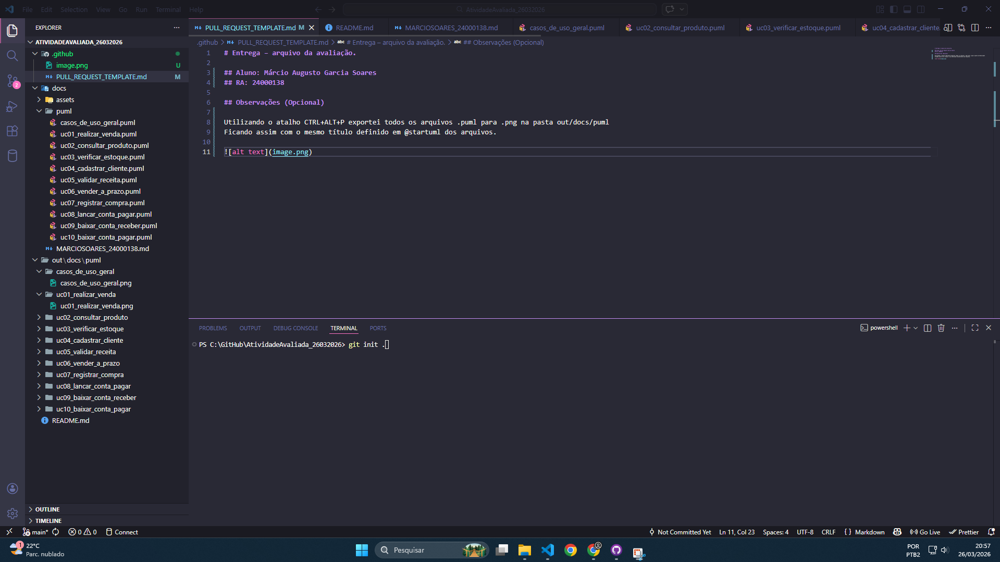

# Entrega – arquivo da avaliação.

## Aluno: Márcio Augusto Garcia Soares
## RA: 24000138

## Observações (Opcional)

Utilizando o atalho CTRL+ALT+P exportei todos os arquivos .puml para .png na pasta out/docs/puml
Ficando assim com o mesmo título definido em @startuml dos arquivos.

