# Avaliação — Engenharia de Software
**Sistema Integrado de Gestão de Farmácia — MVP Definido pelo Estudante**

Aluno: Márcio Augusto Garcia Soares
RA: 24000138
Data: 26/03/2026 

---

# 1. Definição do MVP
Meu MVP cobre a operação de balcão (vendas) e o reflexo imediato disso no estoque e no controle financeiro básico, que é o coração da farmácia.

- **O que está dentro do MVP:** Todo o processo do caixa (passar produto, consultar preço, checar estoque, cobrar à vista ou a prazo), o cadastro de clientes novos na hora, a liberação de receitas pelo farmacêutico, e a entrada de mercadorias via nota fiscal alimentando o estoque e o financeiro.
- **O que está fora do MVP:** Relatórios complexos para a diretoria da matriz e controle de ponto ou comissão de funcionários.
- **Por que fiz essas escolhas:** Pela minha experiência de vida e de trabalho, sei que a ponta da operação não pode travar. O foco foi garantir que o atendimento seja rápido e que o estoque bata com a prateleira. A parte administrativa mais pesada pode ser feita nas próximas versões do sistema.

---

# 2. Regras de Negócio (mínimo: 5)

**RN01 —** Um produto não pode ser vendido no caixa se a quantidade pedida for maior que o saldo físico no estoque da farmácia.
**RN02 —** A venda de remédios controlados (tarja preta/antibiótico) só é liberada se o farmacêutico digitar a senha dele no sistema validando a receita.
**RN03 —** O estoque da prateleira tem que ser atualizado automaticamente, no exato momento em que a venda for finalizada.
**RN04 —** Para o cliente comprar na modalidade "A Prazo" (fiado/convênio), ele obrigatoriamente precisa ter um cadastro aprovado no sistema.
**RN05 —** Toda vez que o gerente der entrada numa nota fiscal de mercadoria, o sistema tem que gerar a dívida automaticamente no módulo Contas a Pagar.

---

# 3. Requisitos Funcionais (mínimo: 8)

**RF01 —** O sistema deve permitir que o atendente registre os itens da venda, escolha a forma de pagamento e finalize a compra.
**RF02 —** O sistema deve permitir a busca rápida de produtos por nome ou bipe do código de barras.
**RF03 —** O sistema deve avisar na tela se o estoque de um produto estiver acabando.
**RF04 —** O sistema deve ter uma tela rápida pro atendente cadastrar um cliente novo direto no caixa.
**RF05 —** O sistema deve emitir o cupom com os itens e o valor total no final da compra.
**RF06 —** O sistema deve deixar o gerente lançar notas de compras para somar os produtos recebidos no estoque.
**RF07 —** O sistema deve gerar um título automático no módulo de Contas a Receber quando a venda for a prazo.
**RF08 —** O sistema deve permitir ao financeiro consultar e dar baixa nas contas (mudar status para Paga ou Recebida).

---

# 🛡 4. Requisitos Não Funcionais (mínimo: 4)

**RNF01 —** O sistema tem que ser web, rodando direto no navegador, pra não precisar instalar programa pesado nos computadores do balcão.
**RNF02 —** O tempo de resposta para buscar um produto no caixa não pode passar de 2 segundos para não atrasar a fila.
**RNF03 —** O sistema precisa separar o acesso por perfis (Atendente, Gerente, Farmacêutico, Financeiro) usando login e senha.
**RNF04 —** O sistema tem que ficar no ar 24 horas por dia para atender as farmácias da rede que são plantão de madrugada.

---

# 5. Casos de Uso (mínimo: 10)
### Inserir **diagrama de casos de uso geral**, demonstrando claramente:

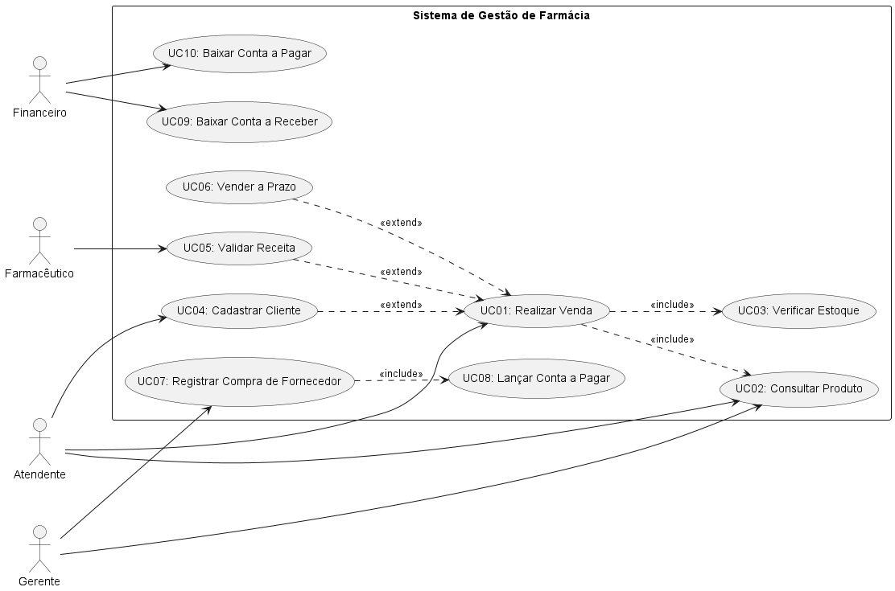

---

# 6. Documentação dos Casos de Uso

---

## **UC01 — Realizar Venda**
**Ator(es):** Atendente
**Descrição:** Processo principal do caixa, onde o atendente passa os produtos, checa estoque, define o pagamento e finaliza a operação.
**Pré-condições:** O atendente precisa estar logado no sistema do caixa.
**Pós-condições:** A venda é salva, o estoque é diminuído e o comprovante é impresso.

### Fluxo Principal
1. O atendente inicia uma nova venda.
2. Busca e insere os produtos desejados.
3. Informa a forma de pagamento do cliente.
4. Finaliza a venda e entrega o comprovante.

### Fluxos Alternativos / Exceções
- FA01 — Cliente quer pagar a prazo (fiado/convênio). O sistema exige cadastro e lança no financeiro.
- FA02 — O remédio é controlado. O sistema trava e pede a senha do farmacêutico.

### Relacionamentos
- **Include:** UC02 (Consultar Produto), UC03 (Verificar Estoque)
- **Extend:** UC04 (Cadastrar Cliente), UC05 (Validar Receita), UC06 (Vender a Prazo)

### Inserir o diagrama de atividades do Caso de Uso
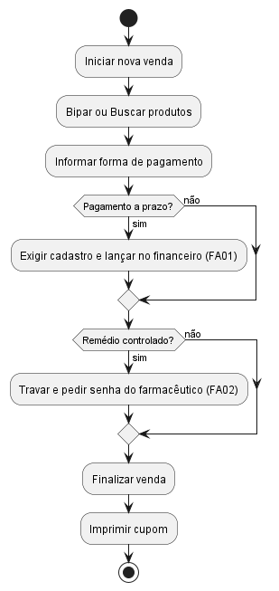

---

## **UC02 — Consultar Produto**
**Ator(es):** Atendente, Gerente
**Descrição:** Permite procurar um produto para ver preço, fabricante ou se tem na loja.
**Pré-condições:** Nenhuma.
**Pós-condições:** As informações do produto aparecem na tela do usuário.

### Fluxo Principal
1. O usuário digita o nome do produto ou passa o leitor de código de barras.
2. O sistema faz a busca no banco de dados.
3. O sistema mostra o preço de venda e a descrição na tela.
4. O usuário fecha a consulta.

### Fluxos Alternativos / Exceções
- FA01 — O usuário digitou errado. O sistema exibe a mensagem "Produto não encontrado".

### Relacionamentos
- **Include:** Nenhum
- **Extend:** Nenhum

### Inserir o diagrama de atividades do Caso de Uso
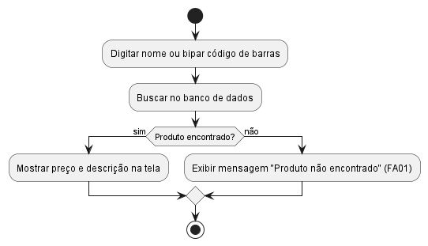

---

## **UC03 — Verificar Estoque**
**Ator(es):** Sistema
**Descrição:** Checagem de segurança que roda "por trás" para não deixar vender produto que não tem fisicamente na loja.
**Pré-condições:** O produto precisa ter sido selecionado pelo atendente na venda.
**Pós-condições:** A quantidade pedida é aprovada para entrar no carrinho da venda.

### Fluxo Principal
1. O sistema lê a quantidade que o cliente pediu.
2. Compara com a quantidade salva no banco de dados.
3. O sistema aprova e libera o item na tela.
4. Fim do processo.

### Fluxos Alternativos / Exceções
- FA01 — O cliente quer 3 caixas, mas só tem 1 no sistema. O sistema bloqueia a ação e avisa "Estoque Insuficiente".

### Relacionamentos
- **Include:** Nenhum
- **Extend:** Nenhum

### Inserir o diagrama de atividades do Caso de Uso
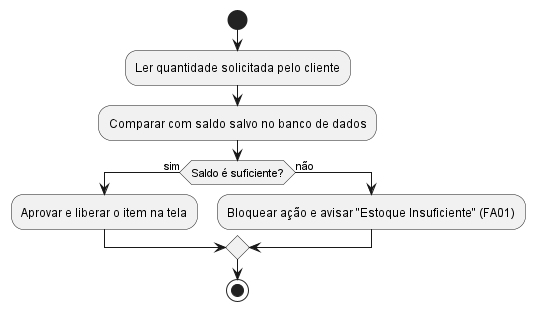

---

## **UC04 — Cadastrar Cliente**
**Ator(es):** Atendente
**Descrição:** Cadastro rápido dos dados do cliente direto do balcão para vincular a compra ao histórico dele.
**Pré-condições:** O cliente informar que ainda não tem ficha na farmácia.
**Pós-condições:** Ficha de cliente criada e vinculada à venda atual.

### Fluxo Principal
1. O atendente clica no botão "Novo Cliente".
2. Pede CPF, Nome e Telefone do cliente.
3. O sistema valida o CPF e salva no banco de dados.
4. O sistema retorna para a tela da venda que estava aberta.

### Fluxos Alternativos / Exceções
- FA01 — O cliente já tinha cadastro e esqueceu. O sistema avisa "CPF já existe" e puxa a ficha antiga automaticamente.

### Relacionamentos
- **Include:** Nenhum
- **Extend:** UC01 (Realizar Venda)

### Inserir o diagrama de atividades do Caso de Uso
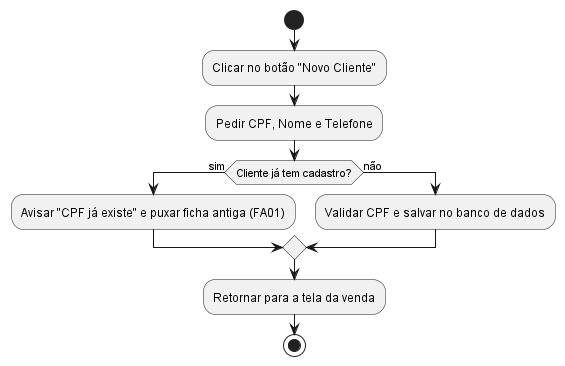

---

## **UC05 — Validar Receita**
**Ator(es):** Farmacêutico
**Descrição:** Etapa de segurança obrigatória onde o farmacêutico libera a venda de remédios controlados ou antibióticos.
**Pré-condições:** Um medicamento de venda controlada foi inserido na compra.
**Pós-condições:** A tela do caixa é destravada para poder receber o pagamento.

### Fluxo Principal
1. O sistema pausa a venda e pede autorização.
2. O farmacêutico analisa o papel da receita apresentada pelo cliente.
3. O farmacêutico digita a senha pessoal dele no sistema.
4. O sistema destrava a venda.

### Fluxos Alternativos / Exceções
- FA01 — A receita é falsa ou está vencida. O farmacêutico recusa e o sistema cancela a venda daquele remédio específico.

### Relacionamentos
- **Include:** Nenhum
- **Extend:** UC01 (Realizar Venda)

### Inserir o diagrama de atividades do Caso de Uso
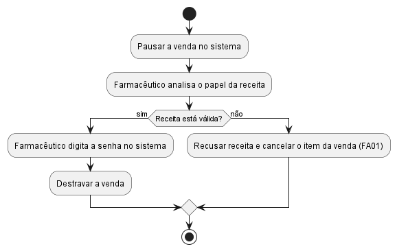

---

## **UC06 — Vender a Prazo**
**Ator(es):** Atendente
**Descrição:** O cliente finaliza a compra para pagar depois (convênio de empresa ou fiado).
**Pré-condições:** O cliente precisa estar com o cadastro selecionado no caixa.
**Pós-condições:** Compra fechada e dívida registrada no módulo de contas a receber.

### Fluxo Principal
1. O atendente seleciona a opção "A Prazo" na hora do pagamento.
2. O sistema verifica se o cliente tem limite de crédito aprovado.
3. O sistema envia o valor para o Contas a Receber.
4. A venda é finalizada e o cliente assina a via do cupom.

### Fluxos Alternativos / Exceções
- FA01 — O cliente estourou o limite de crédito. O sistema mostra "Crédito Negado" e obriga o atendente a pedir dinheiro ou cartão.

### Relacionamentos
- **Include:** Nenhum
- **Extend:** UC01 (Realizar Venda)

### Inserir o diagrama de atividades do Caso de Uso
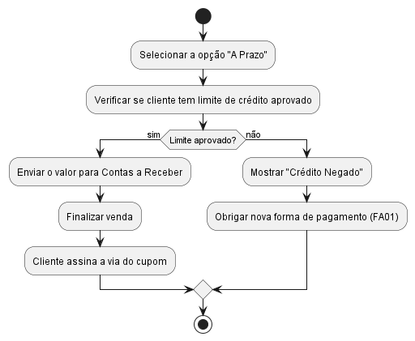

---

## **UC07 — Registrar Compra de Fornecedor**
**Ator(es):** Gerente
**Descrição:** Entrada das caixas de mercadoria que chegaram da distribuidora via Nota Fiscal.
**Pré-condições:** O usuário precisa estar logado com perfil de Gerente.
**Pós-condições:** O estoque dos produtos é somado e o boleto do fornecedor é registrado no sistema.

### Fluxo Principal
1. O gerente digita a chave de acesso da Nota Fiscal de compra.
2. Confere as quantidades dos produtos na tela.
3. O sistema adiciona os itens no saldo do estoque da farmácia.
4. O sistema envia a cobrança do fornecedor para o financeiro.

### Fluxos Alternativos / Exceções
- FA01 — O caminhão entregou uma caixa amassada. O gerente muda a quantidade no sistema antes de salvar para o estoque não ficar furado.

### Relacionamentos
- **Include:** UC08 (Lançar Conta a Pagar)
- **Extend:** Nenhum

### Inserir o diagrama de atividades do Caso de Uso
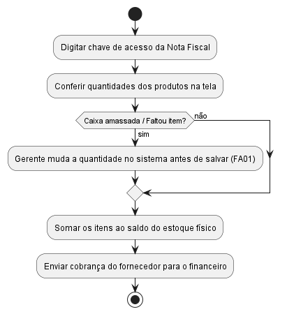

---

## **UC08 — Lançar Conta a Pagar**
**Ator(es):** Sistema
**Descrição:** Rotina automática que cria a dívida da farmácia com o fornecedor depois de dar entrada na mercadoria.
**Pré-condições:** A entrada da compra (UC07) tem que ter sido salva pelo gerente.
**Pós-condições:** Título criado no financeiro com o status "Aberta".

### Fluxo Principal
1. O sistema puxa o valor total da nota fiscal recém-salva.
2. O sistema lê a data de vencimento combinada com o fornecedor.
3. Cria a conta no banco de dados do financeiro marcando como "Aberta".
4. Fim do processo.

### Fluxos Alternativos / Exceções
- FA01 — Se a compra foi paga no ato da entrega, o sistema já registra com o status de "Paga".

### Relacionamentos
- **Include:** Nenhum
- **Extend:** Nenhum

### Inserir o diagrama de atividades do Caso de Uso
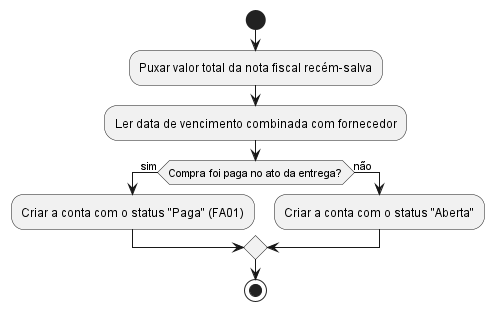

---

## **UC09 — Baixar Conta a Receber**
**Ator(es):** Financeiro
**Descrição:** O cliente da compra a prazo veio na loja pagar a dívida. O financeiro quita a conta dele no sistema.
**Pré-condições:** Existir uma conta com status "Aberta" no nome do cliente.
**Pós-condições:** A conta muda de status para "Recebida" e o limite do cliente é liberado novamente.

### Fluxo Principal
1. O funcionário acessa a tela de Contas a Receber.
2. Digita o CPF ou nome do cliente.
3. Seleciona a dívida pendente e clica em "Receber Pagamento".
4. O sistema quita a conta mudando o status para "Recebida".

### Fluxos Alternativos / Exceções
- FA01 — O cliente pagou só uma parte da conta. O sistema abate o valor pago e mantém a conta como "Aberta" com o saldo restante.

### Relacionamentos
- **Include:** Nenhum
- **Extend:** Nenhum

### Inserir o diagrama de atividades do Caso de Uso
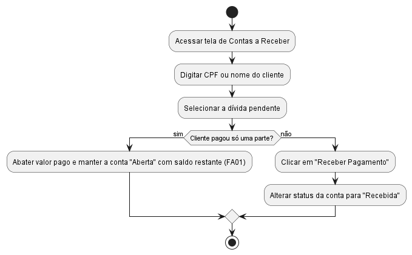

---

## **UC10 — Baixar Conta a Pagar**
**Ator(es):** Financeiro
**Descrição:** A farmácia efetuou o pagamento do boleto do fornecedor pelo banco e precisa informar isso ao sistema.
**Pré-condições:** Ter uma conta de fornecedor com status "Aberta".
**Pós-condições:** O status da conta muda para "Paga".

### Fluxo Principal
1. O funcionário acessa a tela de Contas a Pagar.
2. Filtra as contas pelo dia do vencimento atual.
3. Clica na conta que acabou de pagar no banco e clica em "Dar Baixa".
4. O sistema altera o status da conta para "Paga".

### Fluxos Alternativos / Exceções
- FA01 — O boleto atrasou e cobrou juros. O funcionário digita o valor novo com a multa antes de dar a baixa no sistema.

### Relacionamentos
- **Include:** Nenhum
- **Extend:** Nenhum

### Inserir o diagrama de atividades do Caso de Uso
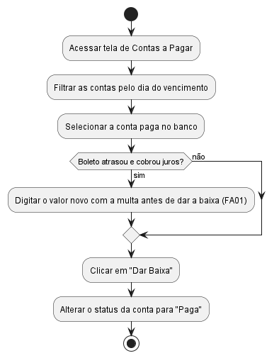